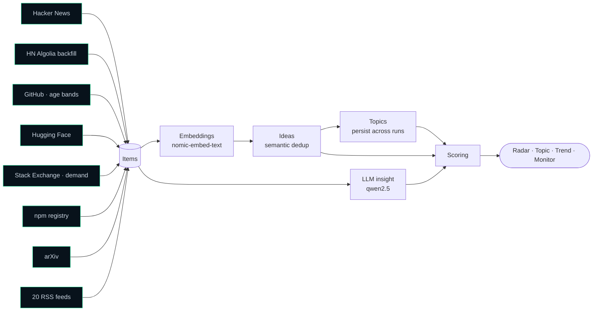
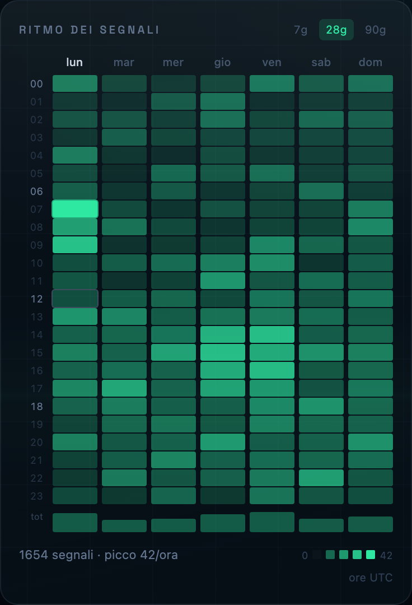

<div align="center">


# Idea Radar

**Surface rising tech opportunities before they saturate.**<br/>
*Not what's popular — what's climbing and still open.*

[](https://github.com/DanieleGiovanardi2408/idea-radar/actions/workflows/ci.yml)
[](https://www.python.org/)
[](https://fastapi.tiangolo.com/)
[](https://react.dev/)
[](https://www.typescriptlang.org/)
[](https://tailwindcss.com/)
[-000000?logo=ollama&logoColor=white)](https://ollama.com/)
[](LICENSE)

[**⬇ Download**](https://github.com/DanieleGiovanardi2408/idea-radar/releases/latest) · [Why](#-why) · [Features](#-features) · [How it works](#-how-it-works) · [The views](#-the-four-views) · [Quick start](#-quick-start) · [CLI](#-cli) · [Configuration](#-configuration) · [Roadmap](#-roadmap)

<br/>


</div>

---

## 💡 Why

A project with 100k stars accumulated over six years is a **closed market**, not an opening. A repo with 2k stars in three months might be one. The radar is built to tell those two apart.

Idea Radar collects signals from **8 free sources** — Hacker News, GitHub, Hugging Face, Stack Exchange, npm, arXiv, Product Hunt, and 20 tech RSS feeds — groups them by meaning with local embeddings, and ranks them by **opportunity**: velocity of growth, room left in the market, and fit with the themes *you* declare.

Everything runs on **free APIs and a local LLM** via [Ollama](https://ollama.com/). No paid services, no cloud model calls, nothing leaves your machine.

## ✨ Features

- 🚀 **Opportunity-first ranking** — momentum beats accumulated popularity; saturation and off-topic act as *gates*, not weights
- 🔥 **Measured heat** — growth velocity computed between real engagement observations (stars/day, points/day) on live-counter sources
- 🧲 **Semantic deduplication** — the same launch on HN, GitHub and a blog collapses into one idea, with a drift-proof criterion that keeps big ideas from becoming catch-alls
- 🎯 **Profiles** — named themes in config (`"AI agents"`, `"IoT"`), each with its own keywords and per-theme fit; the radar is multi-topic by design
- 📌 **User actions** — pin, dismiss, annotate; your decisions persist across runs and are never overwritten by the pipeline
- 📈 **Trends across runs** — topics persist between runs, so what's rising becomes measurable
- 🔍 **Full-archive search** — server-side, in SQL, with honest pagination (`X-Total-Count`)
- 🤖 **Local-only LLM** — summaries, "why it matters", difficulty estimates, next moves and business angles, all on your hardware, with per-idea caching so repeat runs only pay for new content
- 🧪 **Generated text is checked, not trusted** — a prompt ban isn't a guarantee: boilerplate moves are matched and dropped, business angles that drifted off the idea are caught by embedding similarity, and either one gets exactly one retry that says what was rejected
- ⏰ **Hands-free scheduling** — a launchd agent runs the pipeline every few hours, with catch-up after sleep, cross-process locking and an Ollama preflight
- 🛡️ **Resilient collection** — a broken feed is skipped and reported, never crashes a run; polite fetching everywhere (honest User-Agent, throttling, `Retry-After`)

## 🔬 How it works



A single **run** walks the whole pipeline: fetch raw items, embed them locally, collapse items describing the same thing into one **idea**, group related ideas into **topics** that persist across runs, and score everything.

### Scoring

Three metrics are averaged into `quality`, then **two gates multiply** it:

```
composite = quality × gate(fit) × gate(opportunity)
gate(x)   = floor + (1 − floor) × x
```

| Metric | What it measures |
|--------|------------------|
| 🔥 **Heat** | *Speed* of growth, not absolute popularity — measured between consecutive engagement observations where history exists |
| 🏛️ **Credibility** | Trustworthiness of the source, identifiable author |
| 🔧 **Feasibility** | Buildable by a 1–3 person team? Estimated by the LLM against an explicit rubric |
| 🎯 **Fit** | Adherence to your keywords — a **gate**: off-topic is pulled down however popular |
| 🚪 **Opportunity** | Recent **and** not saturated — also a **gate** |

Above `scoring.threshold`, an idea is promoted to `proposed`. Every parameter lives in [`backend/config.yaml`](backend/config.yaml).

<details>
<summary><b>Why gates instead of weights?</b> (the n8n lesson)</summary>
<br/>

As a 30%-weighted addend, `opportunity` didn't actually stop anything: **n8n**, with full saturation and opportunity at exactly **0.00**, still scored 0.56 and sat fourth on the radar — precisely what this project claims not to show you. Multiplying instead puts it at 0.12. There's a test that pins this.

Two gates compress the scale (the top score on a real 1359-idea archive went from 0.65 to 0.46), so `scoring.threshold` is calibrated for the gate formula and is not comparable to a pre-gate value.

Heat only gets *measured* on sources whose engagement is a live counter — HN, HN-Algolia, GitHub, Hugging Face, Stack Exchange, npm. RSS and arXiv have no growing counter, so their heat stays heuristic; the per-source `SourceProfile` says which is which, so the scorer never measures an invented delta.
</details>

<details>
<summary><b>Profiles: the themes you declare</b></summary>
<br/>

`fit` is measured **per profile**, not against one global keyword list. A profile is a named theme in `config.yaml` with its own keywords, and every source queries all of them.

A single averaged fit answers the wrong question: an idea about home automation, measured against "prompt engineering" too, gets a mediocre score that can't distinguish *off-topic* from *half-relevant*. Per profile the answer is sharp — central to one, irrelevant to the others — and the winning profile becomes the idea's **macro-theme**, declared by you rather than guessed by a model.

An idea no profile claims gets `profile: null`, not "the first one in the list". That mattered: with `max()` over all-zero fits the first profile always won, and 1371 ideas out of 1586 came out labelled "ai-agents" without having anything to do with agents.

Cost grows with the number of *profiles*, not keywords: GitHub queries one profile at a time with its keywords in OR; sources that pay one request per keyword take a `max_keywords` cap, and profiles are **interleaved** so a low cap reduces the depth of every theme instead of hiding the last ones.
</details>

<details>
<summary><b>Drift-proof clustering</b> (how one idea once swallowed 740 items)</summary>
<br/>

A signal joins an existing idea only if it passes **two** tests, both against the idea's actual members, never their average:

- **single link** — it must resemble at least *one* member (`clustering.idea_threshold`);
- **cohesion** — it must resemble *every* member (`clustering.cohesion_floor`).

The first finds duplicates; the second stops growth by chaining (A resembles B, B resembles C, A and C are strangers). Comparing against the centroid — what a naive implementation does — fails badly: the more members an idea absorbs, the further its centroid drifts toward the middle of the embedding space, where it is *vaguely similar to everything*. In this repo's own archive one idea had swallowed **740 unrelated items** that way; the fix required both the new criterion and `rebuild-ideas` to repair the history.

Thresholds are calibrated against a ground truth of items that appeared on two sources with the same title — see the comments in `backend/config.yaml`. Topics the model names identically are merged, keeping the older one and its history: one label ("agenti AI per il self-hosting") had been handed out **twelve** times.
</details>

## 🔭 The four views

The interface is a single-page **"radar room"**: a dark, glass-panelled console with a phosphor-green accent, live sweep animation, and [Space Grotesk](https://fonts.google.com/specimen/Space+Grotesk) throughout.

| | |
|:---:|:---:|
| **Radar** — the control room: polar scope, ranked list, video panel, signal rhythm | **Topic** — macro-themes you declared, micro-themes the embeddings found |
|  |  |
| **Trend** — what's moving between runs, with drill-down to each theme | **Monitor** — live pipeline progress and full run history, per-source |
|  |  |

- 🎛️ **Radar** — every idea is a blip; distance from the centre is `1 − composite`, so the best opportunities sit near the middle. Below, the same ideas as a ranked, searchable list (search hits the whole archive, server-side). Pin 📌, dismiss 🗑️ and annotate 📝 — all deep-linkable (`?idea=<id>`).
- 🗂️ **Topic** — two levels: profiles (macro) and semantic clusters (micro). Sortable, and singleton themes are hidden by default: real, but noise to scroll.
- 📈 **Trend** — hover-tooltip area chart per topic, biggest mover highlighted. Needs two runs; with one, deltas are zero by construction.
- 🩺 **Monitor** — ingestion funnel, per-source counts, and a run history where each run expands into its per-source outcome: the place to notice a source that quietly stopped bringing anything.

<details>
<summary><b>The two side panels — and the panel that isn't there</b></summary>
<br/>

<div align="center">

| Who's talking | Signal rhythm |
|:---:|:---:|
|  |  |

</div>

**Signal rhythm** is built on `created_at`, not `fetched_at` — `fetched_at` would draw a vertical stripe every four hours: the rhythm of our own scheduler, not of the network. Items with no date are excluded and the panel says how many.

**Who's talking** searches YouTube once per profile, ordered by view count *within the last week* — dropping the window would return the most-watched videos of all time. Videos are context, never signals: they don't enter the pipeline.

**There is no world map**, deliberately. Across 1762 archived items **not one field carries a location**. A map would have meant ~30 usable points out of 1762 signals presented as "where signals come from". A 2% sample dressed as a fact is worse than no panel.
</details>

## 📦 Desktop app

**[Download the latest release](https://github.com/DanieleGiovanardi2408/idea-radar/releases/latest)** — `.dmg` for macOS (Apple Silicon), `.exe` installer for Windows. One window, backend included: no terminal, no setup. (Intel Mac? Build from source below.)

Two things to know:

- **[Ollama](https://ollama.com/) is still required**, with the two models below — the app can't bundle a 5 GB model. Without it the radar runs in degraded mode (heuristic descriptions, no clustering).
- **macOS will claim the app is "damaged"** — it isn't: the app is not code-signed, and Gatekeeper quarantines unsigned downloads. After moving it to Applications, clear the quarantine once from Terminal, then open normally:

  ```bash
  xattr -cr "/Applications/Idea Radar.app"
  ```

  On Windows, SmartScreen: *More info* → *Run anyway*.

Your data lives in `~/Library/Application Support/Idea Radar` (macOS) or `%APPDATA%\Idea Radar` (Windows): edit `config.yaml` there to declare your themes, and drop a `.env` with your free `GITHUB_TOKEN` in the same folder.

Prefer running from source? Read on.

## 🚀 Quick start

**Prerequisites:** [uv](https://docs.astral.sh/uv/) · Node.js 22+ · [Ollama](https://ollama.com/) with two models:

```bash
ollama pull qwen2.5:7b        # insights: summary, why_text, difficulty
ollama pull nomic-embed-text  # embeddings: clustering and topics
```

> [!TIP]
> Without Ollama the radar still runs in degraded mode: heuristic descriptions and no clustering.

**Backend** — API on `http://localhost:8000`:

```bash
cd backend
cp .env.example .env          # first time only — add your free GITHUB_TOKEN
uv run uvicorn app.api:app --reload
```

**Frontend** — app on `http://localhost:5173` (Vite proxies to the backend, no CORS in dev):

```bash
cd frontend
npm install                   # first time only
npm run dev
```

**First run:**

```bash
cd backend
uv run idea-radar run
```

## 🧰 CLI

| Command | What it does |
|---------|--------------|
| `uv run idea-radar run` | collect → embed → cluster → score |
| `uv run idea-radar ideas` | top ideas (`--proposed` for above-threshold only) |
| `uv run idea-radar topics` | ideas grouped by theme |
| `uv run idea-radar trends` | what's rising and falling between runs |
| `uv run idea-radar stats` | ingestion funnel |
| `uv run idea-radar digest` | markdown briefing of what crossed the threshold |
| `uv run idea-radar export` | CSV export (same filters as the API) |
| `uv run idea-radar rescore` | recompute all scores after a config change — seconds, no model calls |
| `uv run idea-radar heal` | re-embed degraded items, re-merge singleton ideas |
| `uv run idea-radar reinsight` | regenerate LLM summaries, above-threshold first |
| `uv run idea-radar rebuild-ideas` | re-aggregate the whole archive under new thresholds |
| `uv run idea-radar schedule install` | register the launchd agent (macOS) |

<details>
<summary><b>digest</b> — the radar reports to you</summary>
<br/>

```bash
uv run idea-radar digest              # writes backend/data/digests/<timestamp>.md
uv run idea-radar digest --stdout     # print instead of writing
uv run idea-radar digest --since 2026-07-20
```

"New" means *newly above threshold*, not newly seen: an idea can sit in the archive for weeks and cross the line only now — and that is precisely the news. The window starts at the last digest, and the register is the filenames themselves: delete a digest and it regenerates.
</details>

<details>
<summary><b>heal & reinsight</b> — repairing what the incremental pipeline can't revisit</summary>
<br/>

```bash
uv run idea-radar heal                     # re-embed what's missing, re-check singletons
uv run idea-radar heal --skip-embeddings   # no Ollama call: only re-check singletons
```

`heal` fixes items that arrived while Ollama was down (no vector → no way to aggregate, ever) and single-item ideas that would have a home today. It never dissolves an idea with more than one item, and between two singletons the older one survives — a repaired item can't take out the idea that was waiting for it.

```bash
uv run idea-radar reinsight --dry-run   # which ideas, and how long it will take
uv run idea-radar reinsight             # the above-threshold ones (minutes)
uv run idea-radar reinsight --all       # every live idea (hours)
```

There is deliberately **no** "find the wrong summaries" filter: two attempts at building one both failed on real data (word overlap measured the *language* — insights in Italian, items in English — and embeddings can't separate "same domain, different artifact"). So the command doesn't guess: it regenerates by priority.
</details>

<details>
<summary><b>rebuild-ideas & recluster</b> — apply new thresholds to the archive you already have</summary>
<br/>

```bash
uv run idea-radar rebuild-ideas --dry-run            # what the new thresholds would produce
uv run idea-radar rebuild-ideas                      # rebuild ideas, topics and scores
uv run idea-radar recluster --sweep 0.74,0.78,0.82   # then re-tune topic_threshold
```

No fetching, no embedding, no new LLM calls: items and engagement history are untouched, and **pins, dismissals, notes and the insights already paid for are carried over**. `--dry-run` is exact, not an estimate: preview and rebuild share the same grouping function.
</details>

<details>
<summary><b>Scheduled runs</b> (macOS)</summary>
<br/>

```bash
cd backend
uv run idea-radar schedule install    # register the launchd agent
uv run idea-radar schedule status     # loaded? last exit code? recent runs
uv run idea-radar schedule uninstall  # remove it
```

The agent is deliberately dumb: it fires `idea-radar run --scheduled` at login and every 30 minutes, and **all the policy lives in the CLI**, where it is tested. A real run only starts when the last completed one is older than `scheduling.min_interval_hours` (default 4); every other tick is a ~1s skip. On a laptop this behaves like anacron: ticks missed while asleep are coalesced on wake.

Unattended runs are stricter than manual ones, on purpose: if Ollama is down or a model is missing the run is **skipped** and retried at the next tick rather than running degraded, and a cross-process file lock guarantees a scheduled run, a manual run and the API never write to SQLite at the same time. Exit codes are meaningful — 0 ok/skip, 1 failed, 3 Ollama not ready — and `schedule status` translates them.
</details>

## 🔧 Configuration

Runtime behaviour lives in [`backend/config.yaml`](backend/config.yaml) — sources, keywords, scoring weights, clustering thresholds. Secrets live in `backend/.env` (never committed):

| Variable | Purpose |
|----------|---------|
| `GITHUB_TOKEN` | Free GitHub token for the Search API |
| `PRODUCTHUNT_TOKEN` | Free Product Hunt developer token (only if the `producthunt` source is enabled) |
| `OLLAMA_HOST` | Ollama endpoint (default `http://localhost:11434`) |
| `OLLAMA_MODEL` | Default generative model (default `qwen2.5:7b`) |
| `OLLAMA_INSIGHT_MODEL` | Optional smaller model for per-item insights only — the run's bottleneck (~7s/item on the 7B). Empty = use `OLLAMA_MODEL` |
| `EMBEDDING_MODEL` | Embedding model (default `nomic-embed-text`) |
| `YOUTUBE_API_KEY` | Free Google key, video panel only — without it the panel switches itself off with an explanation |

**Five knobs worth knowing:** `scoring.threshold` (how selective the radar is), `scoring.opportunity_floor` (how much a saturated market keeps: 0 erases it, 1 disables the gate), `clustering.idea_threshold` (how aggressively duplicates merge), `clustering.cohesion_floor` (how homogeneous an idea must stay), `scoring.heat_window_days` (the sliding window heat is measured over). The two clustering thresholds are tied to the embedding model: changing `EMBEDDING_MODEL` means re-calibrating them, then `rebuild-ideas`.

<details>
<summary><b>The GitHub collector</b> — why "sort by stars" is a trap</summary>
<br/>

There is no official "trending" endpoint, so the collector is built out of constraints on the Search API: **age bands** on the creation date, sorted by stars, one query per keyword per band.

Drop the date filter and "sorted by stars" means *the most famous repos on earth* — closed markets by definition. That was the original query, and over 51 runs it collected the same 31 repos (freeCodeCamp at 452k stars, tensorflow at 196k), 22 of them created before 2024: the exact opposite of what this project is for.

A single band isn't enough either: the same query returns the same repos every run, so after the first sweep the source stops discovering. `created_windows: [90, 270, 540]` splits the search into three bands and divides the quota **between bands** rather than by global star count — stars accumulate with time, so ranking everything together would always let the oldest band win. The youngest band renews itself as new projects are born; that's what keeps the source alive.
</details>

<details>
<summary><b>Stack Exchange</b> — the demand axis</summary>
<br/>

Every other collector looks at what is being *built* — repos, models, papers, launches. This one looks at what is *missing*: a question that collects votes and has no accepted answer is a problem people have and nobody has solved well. It only keeps unanswered questions (a solved one is documentation, not an opening) and sorts by votes rather than activity, because votes mean "I have this too". Its profile deliberately turns off `maturity_in_saturation`: on GitHub, popular *and* old means a closed market, but an old question that still collects votes is a problem that has *resisted*.
</details>

<details>
<summary><b>Sources & batching details</b></summary>
<br/>

Each source is one entry under `sources` with a `type` (`hn`, `hn_algolia`, `github`, `huggingface`, `stackexchange`, `npm`, `arxiv`, `producthunt`, `rss`) and its own options (`feeds` for RSS, `categories` for arXiv, `created_windows`/`min_stars` for GitHub, `hf_kinds` for Hugging Face, `tags`/`site` for Stack Exchange, `lookback_hours`/`min_points` for the Algolia backfill). The `producthunt` source ships **disabled**: enable it after setting `PRODUCTHUNT_TOKEN`. All per-source scoring parameters live in each collector's `SourceProfile`, next to its code — adding a source is one file plus one line of config, no edits to the scorer. ~70 HTTP requests per run, all free.

Embeddings are asked for in batches (`/api/embed` takes a list): a run with 280 new items makes 9 requests instead of 280 (`throughput.embed_batch_size`, default 32). On an Ollama too old for that route the embedder falls back to one request per text, and says so in the log.
</details>

## 📁 Project structure

```
backend/
  app/
    api.py               # FastAPI endpoints (search, pagination, PATCH /ideas/{id})
    cli.py               # Typer CLI (entry point: `uv run idea-radar`)
    pipeline.py          # run orchestration
    sources/             # collectors: hn, hn_algolia, github, huggingface,
                         #   stackexchange, npm, arxiv, producthunt, rss
    embeddings.py        # local embeddings + similarity
    clustering.py        # items → ideas, ideas → topics
    scoring.py           # metrics and composite
    llm.py               # insights via Ollama
    digest.py            # markdown briefing
    healing.py           # heal / reinsight
    scheduling.py        # unattended-run policy: staleness gate + Ollama preflight
  config.yaml            # sources, keywords, scoring, clustering, scheduling
  tests/                 # 329 tests
frontend/
  src/
    App.tsx              # shell: URL-routed nav, deep-linked detail drawer
    hooks/               # TanStack Query data layer, focus trap, debounce
    components/          # RadarScope, IdeaCard, IdeaDetail, ui primitives
    views/               # Radar, Topic, Trend, Monitor
    index.css            # "radar room" design system (Tailwind v4)
```

## 🧪 Testing & CI

```bash
cd backend && uv run pytest        # 329 tests
cd backend && uv run ruff check .  # lint
cd frontend && npm test            # 83 tests (Vitest + Testing Library)
cd frontend && npm run lint        # oxlint (correctness + jsx-a11y)
cd frontend && npm run typecheck   # tsc
```

All of it runs on every push via [GitHub Actions](.github/workflows/ci.yml). The frontend suite exists because three defects reached the user before it did — a pin that didn't react, a note discarded in silence, and a read-only detail drawer — all of which a component test catches in a second.

## 🧭 Roadmap

- [ ] Clustering at scale — `sqlite-vec` or numpy as a real ANN index. Measured 30 July: not worth it yet (~1–2% of a run); see `scripts/bench_clustering.py`
- [ ] npm download-stats enricher (PyPI is done) and feeding download velocity into `ItemStat`
- [ ] Digest reachable from the API/UI and generated by the scheduled run, not only by hand

<details>
<summary><b>Shipped</b></summary>
<br/>

Semantic deduplication end-to-end · per-idea insight cache · fit-gate · opportunity as a gate, not an addend · delta-based heat on live-counter sources · config-driven sources with self-registering collectors · profiles (per-theme relevance) · 8 collectors including arXiv, Product Hunt, Hugging Face, Stack Exchange (the demand axis) and npm · a GitHub collector that actually looks for *rising* repos · drift-proof clustering (single link + cohesion) with `rebuild-ideas` to repair history · honest trends (a run with nothing new draws a flat line, not a fake crash) · user actions (pin / dismiss / notes) persisted across runs · URL routing + TanStack Query + deep-linkable drawer · server-side search & pagination with `X-Total-Count` · scheduled runs (launchd + tested CLI policy, SQLite in WAL) · HN Algolia backfill · `heal`, `reinsight`, `digest`, CSV export · configurable insight model (`OLLAMA_INSIGHT_MODEL`) · run history with per-source outcomes in the Monitor · a11y (focus trap, roving tabindex on the radar blips) · post-generation validation of the LLM text (boilerplate patterns on moves, embedding coherence on the business angle, one retry that names what was rejected) · CI on every push.
</details>

## 🔒 Privacy & data

This repository contains **code only**. The database with collected data stays **local** and is never committed: `.env`, `*.db` and `data/` are excluded via `.gitignore`. Only `.env.example` (no secrets) is versioned.

## 📄 License

Released under the MIT License — see [LICENSE](LICENSE).

<div align="center">
<sub>Built to spot openings, not echoes — with free APIs and a local LLM.</sub>
</div>
