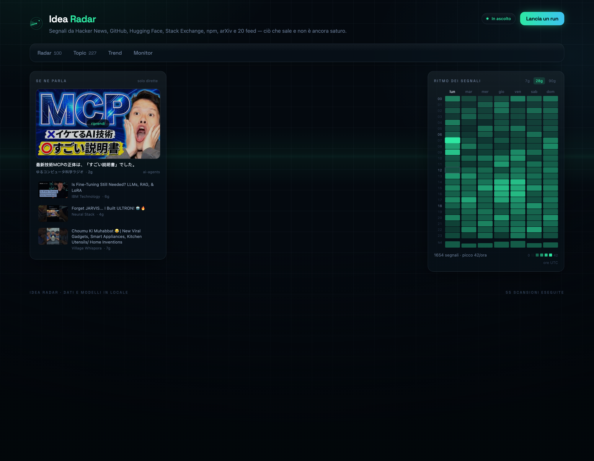
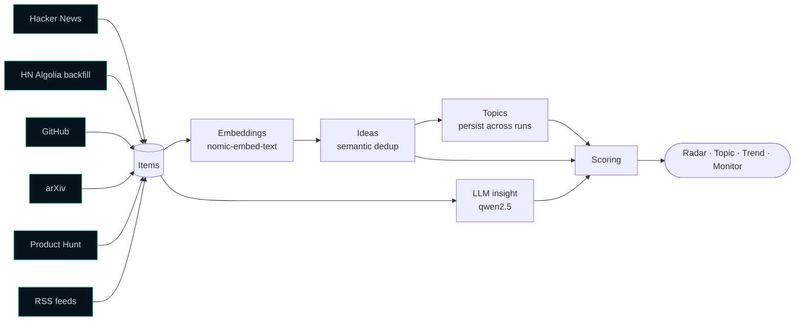
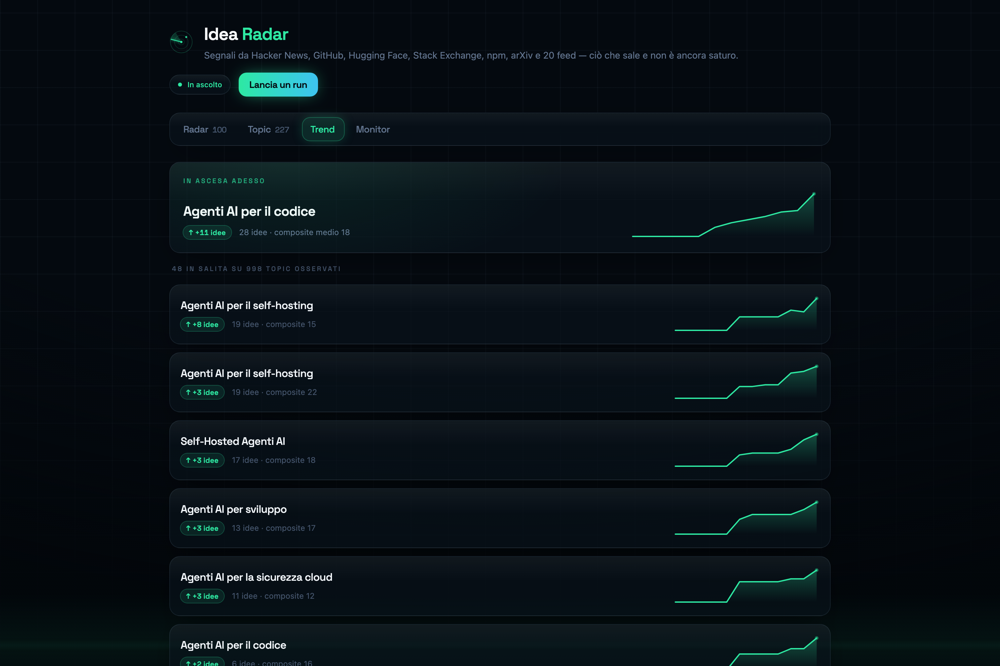
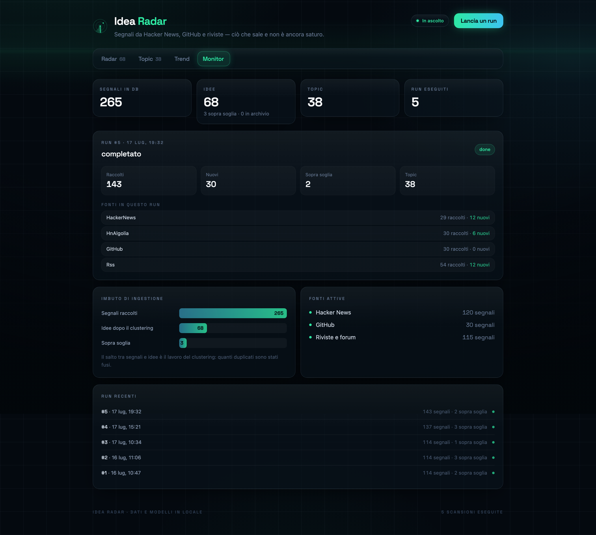
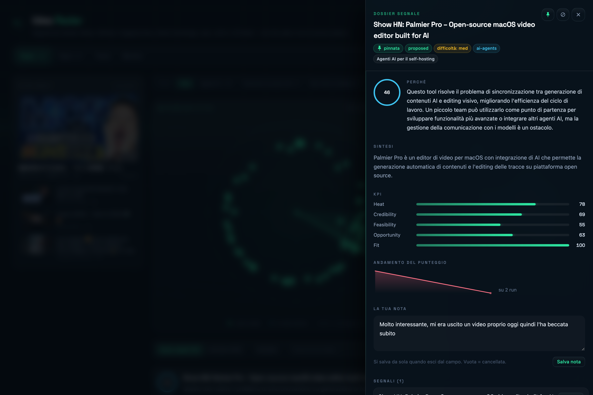

<div align="center">

# Idea Radar

**Surface rising tech opportunities before they saturate — not *what's popular*, but *what's climbing and still open*.**

[](https://www.python.org/)
[](https://fastapi.tiangolo.com/)
[](https://react.dev/)
[](https://www.typescriptlang.org/)
[](https://tailwindcss.com/)
[-000000?logo=ollama&logoColor=white)](https://ollama.com/)
[](LICENSE)

<br/>



</div>

---

Idea Radar collects signals from **Hacker News, GitHub, arXiv, Product Hunt, and tech RSS feeds**, groups them by meaning, and ranks them by **opportunity**. The guiding idea: a project with 100k stars accumulated over six years is a *closed market*, not an opening. A repo with 2k stars in three months might be one. The radar is built to tell those two apart.

Everything runs on **free APIs and a local LLM** (via [Ollama](https://ollama.com/)) — no paid services, no cloud model calls, nothing leaves your machine.

---

## How it works



A single **run** walks the whole pipeline: fetch raw items from the sources, embed them locally, collapse items that describe the same thing into one **idea**, group related ideas into **topics** that persist across runs (so trends become measurable), and score everything.

### Scoring

Three metrics are averaged into `quality`, then **two gates multiply** it:

```
composite = quality × gate(fit) × gate(opportunity)
gate(x)   = floor + (1 − floor) × x
```

| Metric | What it measures |
|--------|------------------|
| **Heat** | *Speed* of growth, not absolute popularity — **measured**, where history exists, between consecutive engagement observations (stars/day, points/day) in a sliding window; new items fall back to an engagement/age heuristic until a second observation lands. |
| **Credibility** | Trustworthiness of the source and whether there's an identifiable author. |
| **Feasibility** | How buildable it is for a team of 1–3 people, estimated by the LLM against an explicit rubric. |
| **Fit** | Adherence to your keywords. A **gate**: off-topic is pulled down however popular it is. |
| **Opportunity** | Recent **and** not yet saturated. Also a **gate** — and it had to become one. As a 30%-weighted addend it didn't actually stop anything: n8n, with full saturation and `opportunity` at exactly 0.00, still scored 0.56 and sat fourth on the radar, which is precisely what this project claims not to show you. Multiplying instead puts it at 0.12. There's a test that pins this. |

Two gates compress the scale — the top score on a real 1359-idea archive goes from 0.65 to 0.46 — so `scoring.threshold` is calibrated for the new formula and is not comparable to a pre-gate value.

Above `scoring.threshold`, an idea is promoted to `proposed`. Every parameter lives in [`backend/config.yaml`](backend/config.yaml).

### Aggregation & topics

Local embeddings do two jobs with one mechanism: merge different signals that tell the same story into a single idea (deduplication), and group related ideas into topics. Because topics persist between runs, a theme that grows from one run to the next becomes a **trend** — the core of the Trend view.

A signal joins an existing idea only if it passes **two** tests, both against the idea's actual members, never against their average:

- **single link** — it must resemble at least *one* member (`clustering.idea_threshold`);
- **cohesion** — it must resemble *every* member (`clustering.cohesion_floor`).

The first finds duplicates; the second stops a group from growing by chaining (A resembles B, B resembles C, A and C are strangers). Comparing against the idea's centroid instead — a plain average — is what a naive implementation does, and it fails badly: the more members an idea absorbs, the further its centroid drifts toward the middle of the embedding space, where it is *vaguely similar to everything*. Big ideas then become magnets that grow on their own. In this repo's own archive one idea had swallowed 740 unrelated items that way, and the fix required both a new criterion and [`rebuild-ideas`](#cli) to repair the history.

Thresholds are calibrated against a ground truth of items that appeared on two sources with the same title, not picked by eye — see the comments in [`backend/config.yaml`](backend/config.yaml) for the numbers and the reasoning.

---

## The four views

The interface is a single-page "radar room": a dark, glass-panelled console with a phosphor-green accent, live sweep animation, and [Space Grotesk](https://fonts.google.com/specimen/Space+Grotesk) throughout. Data and models stay entirely local.

- **Radar** — every idea as a blip on a polar scope. Distance from the centre is `1 − composite`, so the best opportunities sit *on your heading*, near the middle; a rotating sweep makes each blip flash as it passes. Below the scope, the same ideas as a ranked, searchable list. Each idea can be **pinned** (kept on top and shielded from auto-archiving), **dismissed** (hidden until you ask for it back), and **annotated** with a private note — actions that persist across runs and are reachable by deep link (`?idea=<id>`).
- **Topic** — ideas grouped by theme, each topic expandable into its members (fetched per topic, so the accordion isn't limited by the paginated idea list). Sortable by score, size or recency, and by default it hides themes holding a single idea — with calibrated thresholds those are the majority, they're real, but scrolling hundreds of them is noise.
- **Trend** — what's moving between runs, with a hover-tooltip area chart per topic and the biggest mover highlighted; every entry links through to its theme. (Needs at least two runs; with one, deltas are zero by construction.)
- **Monitor** — live pipeline progress: ingestion funnel, per-source counts, active sources, and a full run history where each run expands to its per-source outcome — the place to notice a source that quietly stopped bringing anything. While a run is in progress the whole view polls every 2s.

<div align="center">

| Topic | Trend |
|:---:|:---:|
|  |  |
| **Monitor** | **Idea detail** |
|  |  |

</div>

---

## Features

- **Opportunity-first ranking** that rewards momentum over accumulated popularity.
- **Semantic deduplication** — the same launch on HN, GitHub, and a blog collapses into one idea, with a drift-proof criterion (single link + cohesion, always item-to-item) so a large idea can never turn into a catch-all.
- **Config-driven sources** — each collector declares its own scoring *profile* (velocity/saturation caps, credibility, whether its engagement is a live counter) next to its code and registers itself on import. Adding a source is one file plus one line of `config.yaml` — no edits to the scorer.
- **User actions on ideas** — pin, dismiss, mark-as-seen, and free-text notes, all persisted and orthogonal to the pipeline's own status (a run never overwrites your decisions; a pinned idea is never auto-archived).
- **Local-only LLM** for summaries, "why it matters" notes, and difficulty estimates — nothing is sent to a paid API.
- **Trends across runs** — topics are tracked over time so you can see what's rising.
- **Resilient collection** — a rate-limited or broken feed is skipped, never crashes a run, and its error is written to the run record straight away, so a source that fails *last* still shows up in the Monitor instead of disappearing. Fetching is polite everywhere: honest User-Agent, redirects followed, throttling, `Retry-After`.
- **Cost-aware LLM use** — insights are cached per idea (repeat runs only pay for new content), clearly off-topic items skip the model entirely (fit-gate), and topic names are only regenerated for topics that are both big enough to be worth summarising and actually changed since the last run.
- **Hands-free trend accumulation** — a launchd agent runs the pipeline every few hours while the Mac is awake, with catch-up after sleep/reboot, a cross-process lock, and an Ollama preflight so unattended runs never degrade the data.

---

## Tech stack

| Layer | Stack |
|-------|-------|
| Backend | Python 3.11+, [uv](https://docs.astral.sh/uv/), FastAPI + Uvicorn, SQLModel (SQLite), Typer CLI, pydantic-settings, pytest |
| Frontend | Vite + React 19 + TypeScript, Tailwind CSS v4, React Router, TanStack Query, Space Grotesk |
| Intelligence | Ollama — `qwen2.5:7b` (insights), `nomic-embed-text` (embeddings) |
| Sources | Hacker News (Firebase API + Algolia backfill), GitHub (Search API, one query per keyword, **recently created** repos only), arXiv (Atom API, 4 categories), Product Hunt (GraphQL v2), 20 RSS/Atom feeds |

---

## Getting started

### Prerequisites

- [uv](https://docs.astral.sh/uv/) (manages Python 3.11+ automatically)
- Node.js 20+
- [Ollama](https://ollama.com/) running, with two models pulled:

```bash
ollama pull qwen2.5:7b        # insights: summary, why_text, difficulty
ollama pull nomic-embed-text  # embeddings: clustering and topics
```

> Without Ollama the radar still runs in degraded mode: heuristic descriptions and no clustering (each signal stays its own idea).

### Backend

```bash
cd backend
cp .env.example .env          # first time only — add your free GITHUB_TOKEN
uv run uvicorn app.api:app --reload
```

API on `http://localhost:8000` — health check: `curl http://localhost:8000/health`. If port 8000 is taken, use `--port 8001` and start the frontend with `BACKEND_URL=http://localhost:8001 npm run dev`.

### Frontend

```bash
cd frontend
npm install                   # first time only
npm run dev
```

App on `http://localhost:5173` (Vite proxies to the backend, no CORS in dev).

### CLI

```bash
cd backend
uv run idea-radar run         # collect + embed + cluster + score
uv run idea-radar ideas       # top ideas (--proposed for above-threshold only)
uv run idea-radar topics      # ideas grouped by theme
uv run idea-radar trends      # what's rising and falling between runs
uv run idea-radar stats       # ingestion funnel
uv run pytest                 # tests
```

`digest` turns the radar from something you have to remember to open into something that reports to you:

```bash
uv run idea-radar digest              # writes backend/data/digests/<timestamp>.md
uv run idea-radar digest --stdout     # print instead of writing
uv run idea-radar digest --since 2026-07-20
```

"New" means *newly above threshold*, not newly seen: an idea can sit in the archive for weeks and cross the line only now, and that is precisely the news. The window starts at the last digest, and the register is the filenames themselves — delete a digest and it regenerates. Add it to a `cron`/launchd entry after the run and you have a briefing.

`heal` repairs what the incremental pipeline can't revisit on its own — items that arrived while Ollama was down (no vector, so no way to aggregate them, ever) and single-item ideas that would have a home today, since single-link depends on arrival order:

```bash
uv run idea-radar heal                     # re-embed what's missing, re-check singletons
uv run idea-radar heal --skip-embeddings   # no Ollama call: only re-check singletons
```

`reinsight` regenerates summaries. The LLM insight lives on the *idea*, not the item, so when an idea was a catch-all its summary described only the best of its members — and `rebuild-ideas` spread that text onto every idea born from it, which is how months of model work were preserved but a minority of ideas ended up describing something else.

```bash
uv run idea-radar reinsight --dry-run   # which ideas, and how long it will take
uv run idea-radar reinsight             # the above-threshold ones (minutes)
uv run idea-radar reinsight --all       # every live idea (hours)
```

There is deliberately **no** "find the wrong ones" filter, because two attempts at building one both failed on real data. Counting words shared with the idea's own items measures the *language*, not the topic — insights are in Italian, items in English, so correct summaries scored zero. Comparing embeddings can't separate "same domain, different artifact", which is exactly this case: the catch-all was full of AI/dev-tools items and so are the ideas born from it — on this archive it flagged 19 ideas, mostly with perfectly good summaries, and missed the two that were visibly broken. So the command doesn't guess: it regenerates by priority, above-threshold ideas first, since those are the ones that reach the digest and the top of the radar.

`heal` never dissolves an idea with more than one item, and between two singletons the older one survives — so a repaired item can't take out the idea that was waiting for it, along with its label and its paid-for summary. If Ollama isn't ready the command says so and falls back to the singleton pass instead of failing.

After changing a clustering threshold, apply it to the archive you already have instead of waiting for it to re-form run by run:

```bash
uv run idea-radar rebuild-ideas --dry-run   # what the new thresholds would produce
uv run idea-radar rebuild-ideas             # rebuild ideas, topics and scores
uv run idea-radar recluster --sweep 0.74,0.78,0.82   # then re-tune topic_threshold
```

The rebuild re-aggregates the stored items with the current thresholds. No fetching, no embedding, no new LLM calls: items and their engagement history are untouched, and **pins, dismissals, notes and the insights already paid for are carried over** — user state follows the item that gave the idea its name. Ideas, topics, scores and topic stats are rebuilt; scores are rewritten onto the last completed run so the views have numbers immediately. `--dry-run` prints the outcome without writing, and is exact rather than an estimate: preview and rebuild share the same grouping function.

### Scheduled runs (macOS)

```bash
cd backend
uv run idea-radar schedule install    # register the launchd agent
uv run idea-radar schedule status     # loaded? last exit code? recent runs
uv run idea-radar schedule uninstall  # remove it
```

The agent is deliberately dumb: it fires `idea-radar run --scheduled` at login and every 30 minutes, and **all the policy lives in the CLI**, where it is tested. A real run only starts when the last completed run is older than `scheduling.min_interval_hours` (default 4); every other tick is a ~1s skip, logged to `backend/data/logs/scheduled.log`. On a laptop this behaves like anacron: ticks missed while asleep are coalesced on wake, `RunAtLoad` covers reboots. Exit codes are meaningful — 0 ok/skip, 1 failed run, 3 Ollama not ready — and `schedule status` translates them.

Unattended runs are stricter than manual ones, on purpose: if Ollama is down or a model is missing the run is **skipped** and retried at the next tick (rather than running degraded), and a cross-process file lock guarantees a scheduled run, a manual run, and the API never write to SQLite at the same time.

---

## Configuration

Runtime behaviour lives in [`backend/config.yaml`](backend/config.yaml) — sources, keywords, scoring weights and thresholds, clustering thresholds. Secrets live in `backend/.env` (never committed):

| Variable | Purpose |
|----------|---------|
| `GITHUB_TOKEN` | Free GitHub token for the Search API |
| `PRODUCTHUNT_TOKEN` | Free Product Hunt developer token (only needed if the `producthunt` source is enabled) |
| `OLLAMA_HOST` | Ollama endpoint (default `http://localhost:11434`) |
| `OLLAMA_MODEL` | Insight model (default `qwen2.5:7b`) |
| `EMBEDDING_MODEL` | Embedding model (default `nomic-embed-text`) |

Five knobs worth knowing: `scoring.threshold` controls how selective the radar is (and is tied to the two-gate formula — don't carry an old value over), `scoring.opportunity_floor` how much a saturated market keeps (0 erases it, 1 disables the gate), `clustering.idea_threshold` controls how aggressively duplicate signals merge (higher = only near-identical items collapse), `clustering.cohesion_floor` how homogeneous an idea must stay to keep accepting members (0 disables the check), and `scoring.heat_window_days` sets the sliding window the delta-based heat measures velocity over. The two clustering thresholds are tied to the embedding model: changing `EMBEDDING_MODEL` or the task prefix means re-calibrating them, then `rebuild-ideas`.

The GitHub collector deserves a note, because getting it wrong is silent. There is no official "trending" endpoint, so it is built from two constraints: `created:>` a rolling window, sorted by stars. Drop the date filter and "sorted by stars" means *the most famous repos on earth* — which are closed markets by definition. That was the original query, and over 51 runs it collected the same 31 repos (freeCodeCamp at 452k stars, tensorflow at 196k), 22 of them created before 2024: the exact opposite of the case in the opening paragraph of this README. It now runs one query per keyword rather than one big OR, so no single popular term crowds out the rest.

Each source is one entry under `sources` with a `type` (`hn`, `hn_algolia`, `github`, `arxiv`, `producthunt`, `rss`) and its own options (`feeds` for RSS, `categories` for arXiv, `lookback_hours`/`min_points` for the Algolia backfill). The `producthunt` source ships **disabled**: enable it after setting `PRODUCTHUNT_TOKEN`. All the per-source scoring parameters live in each collector's `SourceProfile` (`backend/app/sources/<source>.py`), not in the scorer.

---

## Project structure

```
backend/
  app/
    api.py               # FastAPI endpoints (incl. PATCH /ideas/{id} for user actions)
    cli.py               # Typer CLI (entry point: `uv run idea-radar`)
    pipeline.py          # run orchestration
    sources/             # collectors: hackernews, hn-algolia, github, arxiv, producthunt, rss
      base.py            #   self-registering type registry (register_source / load_collectors)
      profiles.py        #   per-source scoring profile (velocity/saturation caps, credibility…)
    embeddings.py        # local embeddings + similarity
    clustering.py        # items → ideas, ideas → topics
    scoring.py           # metrics and composite
    llm.py               # insights via Ollama
    digest.py            # `digest`: markdown report of what crossed the threshold
    healing.py           # `heal`: re-embed degraded items, re-merge singletons
    scheduling.py        # unattended-run policy: staleness gate + Ollama preflight
    schedule_launchd.py  # launchd agent: install / uninstall / status
    runlock.py           # cross-process run lock (CLI, API, scheduler)
    queries.py           # shared reads for API/CLI
    models.py            # SQLModel
  config.yaml            # sources, keywords, scoring, clustering, scheduling
  tests/
frontend/
  src/
    App.tsx              # shell: header, URL-routed nav, deep-linked detail drawer
    hooks/               # useRadarData: TanStack Query hooks + run-watching / mutations
    api.ts               # typed client
    types.ts             # shared API types
    index.css            # "radar room" design system (Tailwind v4 theme, glass, motion)
    components/
      RadarScope.tsx     # the polar radar — signature view
      IdeaCard.tsx       # ranked idea card
      IdeaDetail.tsx     # slide-over drawer with KPIs, score history, signals
      ui.tsx             # primitives: Panel, Badge, ScoreRing, MetricBar, AreaSpark…
      motion.tsx         # tiny motion helpers (count-up, stagger) — no libraries
    views/               # Radar, Topic, Trend, Monitor
```

---

## Privacy & data

This repository contains **code only**. The database with collected data stays **local** and is never committed: `.env`, `*.db`, and `data/` are excluded via `.gitignore`. Only `.env.example` (no secrets) is versioned.

---

## Roadmap

Recently shipped: semantic deduplication end-to-end · per-idea insight cache · fit-gate · `recluster` command with threshold sweep · scheduled runs (launchd agent + CLI gate, SQLite in WAL) · engagement-history snapshots per run · idea lifecycle (auto-archive after 14 idle days, auto-revive on new signal) · HN Algolia backfill to heal gaps · immersive "radar room" frontend redesign · **delta-based heat** — velocity measured between consecutive `item_stats` observations, window-scoped, on live-counter sources (GitHub, HN) · **config-driven sources** — self-registering collectors, per-source scoring profiles · **arXiv and Product Hunt connectors** behind the same interface · **user actions** — pin / dismiss / mark-seen / notes, persisted across runs · **URL routing + TanStack Query** frontend data layer · SQL-side filtering, ordering and pagination on `/ideas`.

Also shipped: **drift-proof clustering** — merges decided member-by-member (single link + cohesion) instead of on the centroid, with thresholds calibrated against a ground truth of cross-source duplicates · **`rebuild-ideas`** — re-aggregates the stored archive under new thresholds, preserving items, engagement history, user actions and paid-for insights · **honest trends** — a topic's `avg_composite` is measured on each idea's latest known score, so a run with nothing new draws a flat line instead of a fake crash to zero · **arXiv actually collecting** — it was requesting `http`, getting a redirect the Atom parser then choked on, and failing invisibly because a source that fails last never reached the run record · **a centroid index reused for a whole run** instead of re-reading every idea for every item: 66s → 4s on the clustering step of a 130-item run, measured on a 1300-idea archive.

And: **a GitHub collector that actually looks for rising repos** — plus 20 feeds and 4 arXiv categories, roughly doubling the intake · **opportunity as a gate, not an addend** — the scoring change that finally makes the opening claim of this README true · **`heal`** for the sediment the incremental pipeline can't revisit · **`digest`** as a markdown briefing · **run history with per-source outcomes** in the Monitor · **Topic view that scales** to hundreds of themes · **Trend → Topic drill-down** · HTML entities stripped at collection (Hacker News serves escaped markup, and it was reaching the summaries).

Next:

- [ ] Configurable, smaller insight model for faster runs on modest hardware.
- [ ] Clustering at scale — candidate lookup is an in-memory scan of unit centroids, so it is still linear per item and quadratic per run; at ~1300 ideas that's a few seconds, at ten times that it won't be. Next: `sqlite-vec` or numpy as a real ANN index, and batched embeddings (Ollama's `/api/embed` takes lists).
- [ ] Cross-run digest and a full run history in the Monitor view.

---

## License

Released under the MIT License — see [LICENSE](LICENSE).
