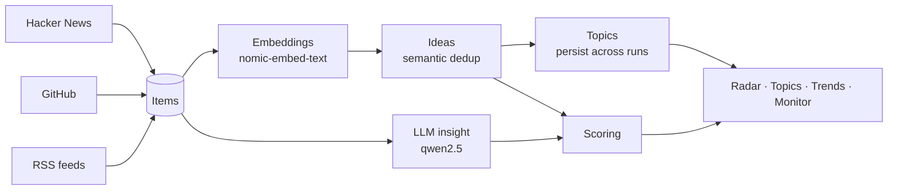

# Idea Radar

**Surface rising tech opportunities before they saturate — not *what's popular*, but *what's climbing and still open*.**


-000000?logo=ollama&logoColor=white)


Idea Radar collects signals from Hacker News, GitHub, and tech RSS feeds, groups
them by meaning, and ranks them by **opportunity**. The guiding idea: a project
with 100k stars accumulated over six years is a *closed market*, not an opening.
A repo with 2k stars in three months might be one. The radar is built to tell
those two apart.

Everything runs on **free APIs and a local LLM** (via [Ollama](https://ollama.com/)).
No paid services, no cloud model calls, no data leaving your machine.

---

## How it works



A single **run** walks the whole pipeline: fetch raw items from the sources,
embed them locally, collapse items that describe the same thing into one **idea**,
group related ideas into **topics** that persist across runs (so trends become
measurable), and score everything.

### Scoring

Each idea gets four quality metrics, combined into a weighted average (`quality`)
and multiplied by relevance:

```
composite = quality × (relevance_floor + (1 − relevance_floor) × fit)
```

- **heat** — *speed* of growth (stars/day on GitHub, engagement on HN/RSS), not
  absolute popularity.
- **credibility** — trustworthiness of the source and author.
- **feasibility** — how buildable it is for a team of 1–3 people, estimated by
  the LLM against an explicit rubric.
- **opportunity** — recent **and** not yet saturated. This is the brake that
  keeps established, finished projects off the top.
- **fit** — adherence to your keywords. Not an addend but a **multiplier**: an
  off-topic idea is pulled down even if it's wildly popular.

Above `scoring.threshold`, an idea is promoted to `proposed`. Every parameter
lives in [`backend/config.yaml`](backend/config.yaml).

### Aggregation & topics

Local embeddings do two jobs with one mechanism: merge different signals that
tell the same story into a single idea (deduplication), and group related ideas
into topics. Because topics persist between runs, a theme that grows from one run
to the next becomes a **trend** — the core of the Trend view. (With a single run
the Trend view is empty by construction: it needs at least two.)

---

## Features

- **Opportunity-first ranking** that rewards momentum over accumulated popularity.
- **Semantic deduplication** — the same launch on HN, GitHub, and a blog collapses
  into one idea.
- **Local-only LLM** for summaries, "why it matters" notes, and difficulty
  estimates — nothing is sent to a paid API.
- **Trends across runs** — topics are tracked over time so you can see what's rising.
- **Resilient collection** — a rate-limited or broken feed is skipped, never
  crashes a run; RSS fetching is polite (honest User-Agent, throttling, `Retry-After`).
- **Cost-aware LLM use** — insights are cached per idea (repeat runs only pay for
  new content) and clearly off-topic items skip the model entirely (fit-gate).
- **Four views** — Radar (ranked ideas), Topic (grouped by theme), Trend (what's
  moving between runs), Monitor (live pipeline progress).

---

## Tech stack

| Layer | Stack |
|-------|-------|
| Backend | Python 3.11+, [uv](https://docs.astral.sh/uv/), FastAPI + Uvicorn, SQLModel (SQLite), Typer CLI, pydantic-settings, pytest |
| Frontend | Vite + React + TypeScript, Tailwind CSS v4 |
| Intelligence | Ollama — `qwen2.5:7b` (insights), `nomic-embed-text` (embeddings) |
| Sources | Hacker News (Firebase API), GitHub (Search API), RSS |

---

## Getting started

### Prerequisites

- [uv](https://docs.astral.sh/uv/) (manages Python 3.11+ automatically)
- Node.js 20+
- [Ollama](https://ollama.com/) running, with two models pulled:

```bash
ollama pull qwen2.5:7b        # insights: summary, why_text, difficulty
ollama pull nomic-embed-text  # embeddings: clustering and topics
```

> Without Ollama the radar still runs in degraded mode: heuristic descriptions
> and no clustering (each signal stays its own idea).

### Backend

```bash
cd backend
cp .env.example .env          # first time only — add your free GITHUB_TOKEN
uv run uvicorn app.api:app --reload
```

API on `http://localhost:8000` — health check: `curl http://localhost:8000/health`.
If port 8000 is taken, use `--port 8001` and start the frontend with
`BACKEND_URL=http://localhost:8001 npm run dev`.

### Frontend

```bash
cd frontend
npm install                   # first time only
npm run dev
```

App on `http://localhost:5173` (Vite proxies to the backend, no CORS in dev).

### CLI

```bash
cd backend
uv run idea-radar run         # collect + embed + cluster + score
uv run idea-radar ideas       # top ideas (--proposed for above-threshold only)
uv run idea-radar topics      # ideas grouped by theme
uv run idea-radar trends      # what's rising and falling between runs
uv run idea-radar stats       # ingestion funnel
uv run pytest                 # tests
```

---

## Configuration

Runtime behaviour lives in [`backend/config.yaml`](backend/config.yaml) — sources,
keywords, scoring weights and thresholds, clustering thresholds. Secrets live in
`backend/.env` (never committed):

| Variable | Purpose |
|----------|---------|
| `GITHUB_TOKEN` | Free GitHub token for the Search API |
| `OLLAMA_HOST` | Ollama endpoint (default `http://localhost:11434`) |
| `OLLAMA_MODEL` | Insight model (default `qwen2.5:7b`) |
| `EMBEDDING_MODEL` | Embedding model (default `nomic-embed-text`) |

Two knobs worth knowing: `scoring.threshold` controls how selective the radar is,
and `clustering.idea_threshold` controls how aggressively duplicate signals merge
(higher = only near-identical items collapse).

---

## Project structure

```
backend/
  app/
    api.py         # FastAPI endpoints
    cli.py         # Typer CLI (entry point: `uv run idea-radar`)
    pipeline.py    # run orchestration
    sources/       # collectors: hackernews, github, rss
    embeddings.py  # local embeddings + similarity
    clustering.py  # items → ideas, ideas → topics
    scoring.py     # metrics and composite
    llm.py         # insights via Ollama
    queries.py     # shared reads for API/CLI
    models.py      # SQLModel
  config.yaml      # sources, keywords, scoring, clustering
  tests/
frontend/
  src/
    views/         # Radar, Topic, Trend, Monitor
    components/     # cards, detail, UI primitives
```

---

## Privacy & data

This repository contains **code only**. The database with collected data stays
**local** and is never committed: `.env`, `*.db`, and `data/` are excluded via
`.gitignore`. Only `.env.example` (no secrets) is versioned.

---

## Roadmap

Recently shipped:

- [x] Semantic deduplication working end-to-end — embeddings use the `clustering:`
      task prefix and `idea_threshold` is tuned (114 raw items collapse to ~36 ideas).
- [x] Per-idea insight cache — repeat runs only pay the LLM for genuinely new content.
- [x] Fit-gate — clearly off-topic items skip the LLM entirely.
- [x] Consistent idea status — an idea's status/summary come from its best-scoring item.
- [x] `recluster` command — re-groups ideas into topics from cached embeddings in
      seconds, for fast `topic_threshold` tuning without a full run.

Next:

- [ ] Topic-level tuning (raise `topic_threshold` for finer, less catch-all themes).
- [ ] Scheduled/automated runs so trends accumulate on their own.
- [ ] Idea lifecycle — archive or decay stale ideas so the radar stays fresh.
- [ ] Configurable, smaller insight model for faster runs on modest hardware.
- [ ] More source connectors behind the same interface.

---

## License

Released under the MIT License — see [LICENSE](LICENSE).
